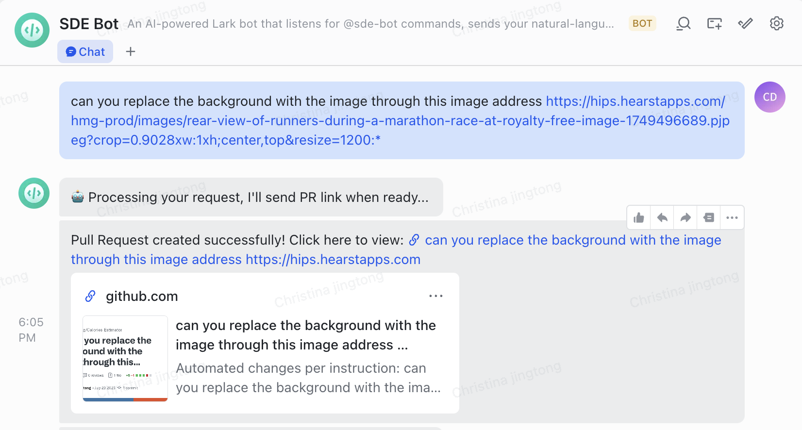

# Lark-sde-bot

A Claude Code powered Lark bot that automatically implements codebase changes from natural language, responding with a PR link. The creation of this bot was inspired by the frustration of software developers who receive a ton of small requests from product managers.

Lark is an enterprise collaboration platform developed by ByteDance.

## Example Usage

## Prerequisites

- Python 3.11+
- Docker
- GitHub account with Personal Access Token
- Lark Developer account
- Anthropic account, API Key and Base URL
- Google Cloud Platform account (for deployment)
